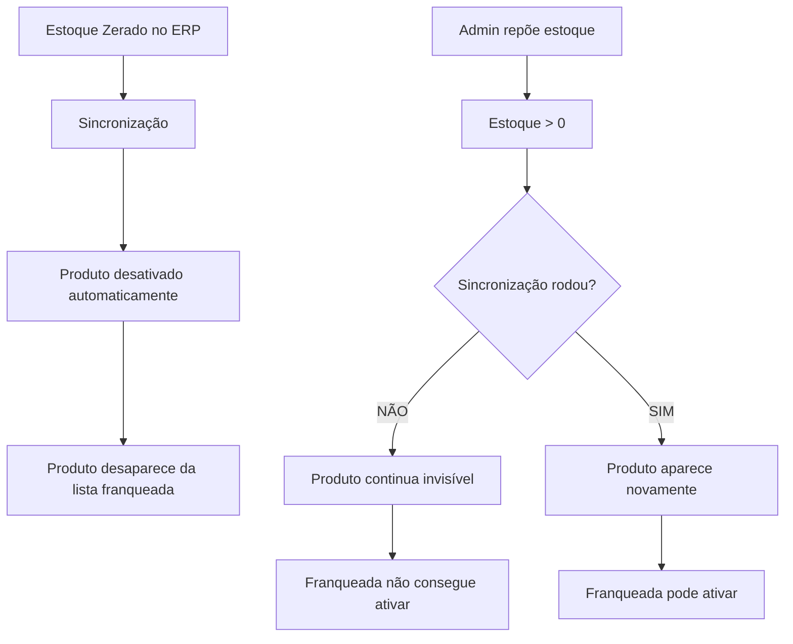

# 🔍 ANÁLISE: Problema de Estoque e Ativação de Produtos

**Data:** 31/12/2025  
**Problema Reportado:** Produtos com estoque reposto não aparecem e não conseguem ser ativados nas franqueadas

---

## 🚨 PROBLEMAS IDENTIFICADOS

### **1. FILTRO CRÍTICO NO CARREGAMENTO** 🔴

**Arquivo:** `app/franqueada/produtos/page.tsx`  
**Linha:** 131

```typescript
// FILTRO: Não mostrar produtos inativos no admin ou sem estoque
if (!produto || !produto.ativo || produto.estoque <= 0) return null;
```

#### ⚠️ **PROBLEMA:**
Este filtro **BLOQUEIA COMPLETAMENTE** produtos que:
- Estão inativos no admin (`!produto.ativo`)
- Têm estoque zerado (`produto.estoque <= 0`)

#### 🎯 **IMPACTO:**
1. ❌ Se você desativar um produto no admin, ele **DESAPARECE** da lista das franqueadas
2. ❌ Se o estoque zerar, o produto **DESAPARECE** da lista
3. ❌ **Quando você repõe o estoque**, o produto continua desaparecido até a próxima sincronização
4. ❌ **Se você tentar ativar**, o produto não aparece na lista

---

### **2. FLUXO DE SINCRONIZAÇÃO COM LÓGICA CONFLITANTE** 🔴

**Arquivo:** `app/api/sync-produtos/route.ts`

#### Comportamento Atual:

1. **Quando estoque = 0:**
   - ✅ Desativa automaticamente em `produtos_franqueadas_precos` (campo `ativo_no_site`)
   - ✅ Desativa automaticamente em `reseller_products` (campo `is_active`)

2. **Quando estoque > 0:**
   - ✅ Reativa automaticamente em `produtos_franqueadas_precos`
   - ✅ Reativa automaticamente em `reseller_products`
   - ⚠️ **MAS** isso só acontece na **sincronização**

#### ⚠️ **PROBLEMA:**
```
Você repõe estoque manualmente no admin
    ↓
Estoque atualizado na tabela produtos
    ↓
Franqueada tenta ver/ativar produto
    ↓
FILTRO bloqueia porque não houve sincronização ainda
    ↓
Produto continua invisível! 😱
```

---

### **3. PRODUTOS NÃO ATIVAM MESMO COM ESTOQUE** 🔴

**Cenário reportado:**
> "Tem um modelo que eu tentei ativar e ele está disponível mas ele está inativo, e eu tentei ativar e ele não ativou"

#### Causa Raiz:
1. Produto estava sem estoque
2. Foi desativado automaticamente pela sincronização
3. Você repôs o estoque manualmente
4. **O produto desapareceu da lista** por causa do filtro
5. Quando você tenta ativar, o sistema não encontra o produto

---

## 📊 FLUXO ATUAL (PROBLEMÁTICO)



---

## 🎯 COMPORTAMENTOS IDENTIFICADOS

### ✅ O que FUNCIONA:

1. **Sincronização automática de estoque**
   - ERP → Admin: Funciona
   - Estoque = 0 → Desativa automaticamente
   - Estoque > 0 → Reativa automaticamente (na sync)

2. **Mudança de foto e nome**
   - ✅ Atualiza corretamente na sincronização

### ❌ O que NÃO FUNCIONA:

1. **Reposição manual de estoque**
   - ❌ Produto não reaparece até sincronização
   - ❌ Franqueada não consegue ativar
   - ❌ Produto fica "fantasma"

2. **Ativação manual após reposição**
   - ❌ Produto invisível na lista
   - ❌ Botão de ativar não funciona
   - ❌ Necessita sincronização manual

3. **Produtos inativos no admin**
   - ❌ Desaparecem completamente
   - ❌ Não há opção para ver produtos inativos
   - ❌ Sem controle manual

---

## 🔧 SOLUÇÕES PROPOSTAS

### **SOLUÇÃO 1: Remover Filtro Restritivo** ⭐ RECOMENDADA

**Mudança:** Linha 131 de `app/franqueada/produtos/page.tsx`

```typescript
// ❌ ANTES (Bloqueia tudo)
if (!produto || !produto.ativo || produto.estoque <= 0) return null;

// ✅ DEPOIS (Mostra tudo, controla na interface)
if (!produto) return null;
```

**Benefícios:**
- ✅ Franqueada vê TODOS os produtos vinculados
- ✅ Pode ver status de estoque (0, 10, 100, etc)
- ✅ Pode ver se produto está ativo no admin
- ✅ Pode decidir se quer ativar ou não
- ✅ Transparência total

**Ajuste na Interface:**
- Mostrar badge "SEM ESTOQUE" em vermelho
- Mostrar badge "INATIVO NO ADMIN" em cinza
- Desabilitar botão de ativar se estoque = 0 OU inativo no admin
- Tooltip explicando: "Produto sem estoque ou inativo no admin"

---

### **SOLUÇÃO 2: Adicionar Trigger de Reativação Automática**

**Criar trigger no Supabase:**

```sql
-- Quando o estoque muda de 0 para > 0, reativar automaticamente
CREATE OR REPLACE FUNCTION reativar_produto_com_estoque()
RETURNS TRIGGER AS $$
BEGIN
  -- Se estoque mudou de 0 para > 0 e produto está ativo
  IF OLD.estoque = 0 AND NEW.estoque > 0 AND NEW.ativo = true THEN
    
    -- Reativar em franqueadas
    UPDATE produtos_franqueadas_precos
    SET ativo_no_site = true
    WHERE produto_franqueada_id IN (
      SELECT id FROM produtos_franqueadas WHERE produto_id = NEW.id
    );
    
    -- Reativar em revendedoras
    UPDATE reseller_products
    SET is_active = true
    WHERE product_id = NEW.id;
    
    RAISE NOTICE 'Produto % reativado automaticamente (estoque: %)', NEW.nome, NEW.estoque;
  END IF;
  
  RETURN NEW;
END;
$$ LANGUAGE plpgsql;

-- Aplicar trigger
CREATE TRIGGER trigger_reativar_estoque
AFTER UPDATE ON produtos
FOR EACH ROW
EXECUTE FUNCTION reativar_produto_com_estoque();
```

**Benefícios:**
- ✅ Reativação instantânea quando estoque é reposto
- ✅ Não depende de sincronização
- ✅ Funciona com alterações manuais

---

### **SOLUÇÃO 3: Adicionar Filtro Toggle na Interface**

**Adicionar opção:**
```typescript
const [mostrarInativos, setMostrarInativos] = useState(false);
```

**Na interface:**
```tsx
<label className="flex items-center gap-2">
  <input 
    type="checkbox"
    checked={mostrarInativos}
    onChange={(e) => setMostrarInativos(e.target.checked)}
  />
  Mostrar produtos inativos/sem estoque
</label>
```

**Benefícios:**
- ✅ Franqueada escolhe o que ver
- ✅ Padrão: mostra apenas produtos disponíveis
- ✅ Opção: ver todos para gerenciar melhor

---

## 📝 RECOMENDAÇÃO FINAL

### Implementar as 3 soluções em ordem:

1. **URGENTE** 🔴 - **SOLUÇÃO 1:** Remover filtro (30 min)
   - Impacto imediato
   - Resolve problema de visibilidade

2. **IMPORTANTE** 🟡 - **SOLUÇÃO 2:** Criar trigger (15 min)
   - Automação real-time
   - Independe de sincronização

3. **MELHORIA** 🟢 - **SOLUÇÃO 3:** Toggle na interface (20 min)
   - UX melhorada
   - Flexibilidade para franqueada

---

## 🧪 TESTES NECESSÁRIOS

### Após implementar:

1. **Teste 1: Reposição de estoque**
   - Zerar estoque de um produto
   - Esperar desativação automática
   - Repor estoque manualmente
   - ✅ Verificar se reaparece na lista
   - ✅ Verificar se reativa automaticamente

2. **Teste 2: Ativação manual**
   - Produto com estoque > 0
   - Produto ativo no admin
   - ✅ Verificar se consegue ativar na franqueada

3. **Teste 3: Produto inativo no admin**
   - Desativar produto no admin
   - ✅ Verificar se mostra badge "INATIVO"
   - ✅ Verificar se desabilita botão de ativar

4. **Teste 4: Sincronização**
   - Mudar nome e foto no ERP
   - Rodar sincronização
   - ✅ Verificar se atualiza corretamente

---

## 📊 ESTATÍSTICAS DE IMPACTO

**Produtos Afetados:**
- Produtos com estoque zerado: Invisíveis
- Produtos repostos: Invisíveis até sync
- Produtos inativos admin: Invisíveis

**Usuários Impactados:**
- ✅ Franqueadas: Não conseguem ver/ativar produtos repostos
- ✅ Admin: Precisa rodar sync manual frequentemente
- ✅ Clientes finais: Produtos disponíveis mas não aparecem no site

---

**Status:** 🔴 Problema crítico identificado  
**Solução:** ✅ Pronta para implementar  
**Tempo estimado:** 1h (todas as soluções)  
**Prioridade:** URGENTE
