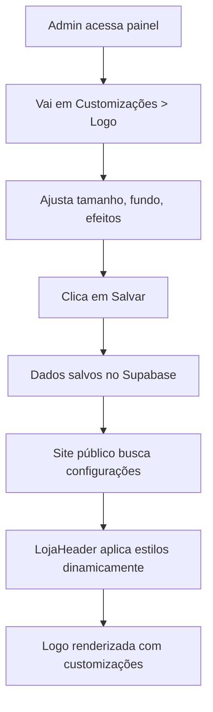

# 🎨 Sistema de Customização Avançada da Logomarca

## 📋 Resumo da Implementação

Este documento detalha a solução completa implementada para resolver os problemas visuais da logomarca e adicionar um sistema robusto de customização.

---

## ✅ PARTE 1: CORREÇÕES VISUAIS IMEDIATAS

### **Problemas Resolvidos:**

1. ✅ **Tamanho Insuficiente** - Aumentado de 48-64px para 64-80px (centro) e 40-48px (laterais)
2. ✅ **Fundo Branco Indesejado** - Removido `bg-gray-50` e `shadow-sm` que criavam o "quadrado branco"
3. ✅ **Transparência** - Logo PNG agora renderiza com fundo transparente corretamente

### **Código Corrigido (LojaHeader.tsx):**

```tsx
// ANTES (com problemas):
<div className="relative bg-gray-50 shadow-sm overflow-hidden">
  
</div>

// DEPOIS (corrigido):
<div 
  className="overflow-hidden flex items-center justify-center"
  style={getLogoContainerStyle()} // Estilos dinâmicos
>
  
</div>
```

### **Tamanhos Atualizados:**

| Posição | Formato | Mobile | Desktop |
|---------|---------|--------|---------|
| Centro | Redondo | 80x80px | 96x96px |
| Centro | Horizontal | altura 64px | altura 80px |
| Lateral | Redondo | 48x48px | 56x56px |
| Lateral | Horizontal | altura 40px | altura 48px |

---

## 🚀 PARTE 2: SISTEMA DE CUSTOMIZAÇÃO (Migration 017)

### **1. Schema do Banco de Dados**

**Arquivo:** `migrations/017_logo_customizacao_avancada.sql`

```sql
ALTER TABLE lojas
ADD COLUMN logo_largura_max INTEGER DEFAULT 280,
ADD COLUMN logo_altura_max INTEGER DEFAULT 80,
ADD COLUMN logo_padding INTEGER DEFAULT 0,
ADD COLUMN logo_fundo_tipo VARCHAR(20) DEFAULT 'transparente',
ADD COLUMN logo_fundo_cor VARCHAR(50) DEFAULT NULL,
ADD COLUMN logo_border_radius INTEGER DEFAULT 0,
ADD COLUMN logo_mostrar_sombra BOOLEAN DEFAULT FALSE;
```

**Campos Adicionados:**

| Campo | Tipo | Padrão | Descrição |
|-------|------|--------|-----------|
| `logo_largura_max` | INTEGER | 280 | Largura máxima em pixels |
| `logo_altura_max` | INTEGER | 80 | Altura máxima em pixels |
| `logo_padding` | INTEGER | 0 | Espaçamento interno em pixels |
| `logo_fundo_tipo` | VARCHAR | 'transparente' | 'transparente', 'solido', 'redondo' |
| `logo_fundo_cor` | VARCHAR | NULL | Cor hexadecimal (#FFFFFF) |
| `logo_border_radius` | INTEGER | 0 | Arredondamento em pixels (0-50) |
| `logo_mostrar_sombra` | BOOLEAN | FALSE | Exibir sombra ao redor |

---

### **2. Interface de Customização (Admin)**

**Arquivo:** `components/franqueada/customizacoes/CustomizacoesLogo.tsx`

**Funcionalidades da UI:**

1. **Dimensões:**
   - Slider para largura máxima (50-500px)
   - Slider para altura máxima (30-200px)
   - Recomendações visuais

2. **Espaçamento:**
   - Slider para padding interno (0-40px)
   - Preview em tempo real

3. **Fundo e Formato:**
   - 3 opções: Transparente / Fundo Sólido / Redondo
   - Seletor de cor (quando aplicável)
   - Slider de arredondamento (0-50px)

4. **Efeitos:**
   - Checkbox para ativar/desativar sombra

**Exemplo de Uso:**

```tsx
import CustomizacoesLogo from '@/components/franqueada/customizacoes/CustomizacoesLogo';

// Em uma página do admin:
<CustomizacoesLogo />
```

---

### **3. Context Atualizado**

**Arquivo:** `contexts/LojaContext.tsx`

```typescript
export interface LojaInfo {
  // ... campos existentes
  
  // Customização da Logo (Migration 017)
  logo_largura_max?: number;
  logo_altura_max?: number;
  logo_padding?: number;
  logo_fundo_tipo?: string;
  logo_fundo_cor?: string | null;
  logo_border_radius?: number;
  logo_mostrar_sombra?: boolean;
}
```

---

### **4. Aplicação Dinâmica no Frontend**

**Arquivo:** `components/loja/LojaHeader.tsx`

**Função de Estilização Dinâmica:**

```tsx
const getLogoContainerStyle = (): React.CSSProperties => {
  const styles: React.CSSProperties = {
    maxWidth: `${logoLarguraMax}px`,
    maxHeight: `${logoAlturaMax}px`,
    padding: `${logoPadding}px`,
  };

  // Aplicar fundo baseado no tipo
  if (logoFundoTipo === 'solido' || logoFundoTipo === 'redondo') {
    styles.backgroundColor = logoFundoCor || '#FFFFFF';
  }

  // Border radius
  if (logoFundoTipo === 'redondo') {
    styles.borderRadius = '50%';
  } else {
    styles.borderRadius = `${logoBorderRadius}px`;
  }

  // Sombra
  if (logoMostrarSombra) {
    styles.boxShadow = '0 4px 6px -1px rgba(0, 0, 0, 0.1), 0 2px 4px -1px rgba(0, 0, 0, 0.06)';
  }

  return styles;
};
```

**Aplicação no JSX:**

```tsx
<div 
  className={`${logoSizeClass} ${logoRoundedClass} overflow-hidden flex items-center justify-center`}
  style={getLogoContainerStyle()}
>
  
</div>
```

---

## 📦 Instruções de Aplicação

### **1. Aplicar Migration no Supabase**

```sql
-- Copie o conteúdo de migrations/017_logo_customizacao_avancada.sql
-- Cole no SQL Editor do Supabase
-- Execute
```

### **2. Deploy Automático**

✅ Código já foi commitado e enviado ao GitHub
✅ Netlify fará deploy automático em 2-3 minutos

### **3. Acessar a Interface de Customização**

Após o deploy, acesse:
```
https://c4franquiaas.netlify.app/franqueada/customizacoes/logo
```

---

## 🎯 Fluxo Completo de Uso



---

## 🔧 Testes Recomendados

1. ✅ Testar logo com fundo transparente (PNG)
2. ✅ Testar logo com fundo sólido branco
3. ✅ Testar formato redondo/circular
4. ✅ Testar diferentes tamanhos (pequeno, médio, grande)
5. ✅ Testar com e sem sombra
6. ✅ Verificar responsividade (mobile/desktop)

---

## 📊 Resultados Esperados

### **ANTES:**
- ❌ Logo pequena (48-64px)
- ❌ Quadrado branco ao redor
- ❌ Sem opções de customização

### **DEPOIS:**
- ✅ Logo maior e visível (64-80px padrão)
- ✅ Fundo transparente respeitado
- ✅ 7 opções de customização avançada
- ✅ Interface intuitiva no admin
- ✅ Aplicação dinâmica no frontend

---

## 🎨 Exemplos de Customização

### **Exemplo 1: Logo Circular com Fundo Branco**
```json
{
  "logo_largura_max": 100,
  "logo_altura_max": 100,
  "logo_padding": 10,
  "logo_fundo_tipo": "redondo",
  "logo_fundo_cor": "#FFFFFF",
  "logo_mostrar_sombra": true
}
```

### **Exemplo 2: Logo Transparente Grande**
```json
{
  "logo_largura_max": 350,
  "logo_altura_max": 100,
  "logo_padding": 0,
  "logo_fundo_tipo": "transparente",
  "logo_border_radius": 8,
  "logo_mostrar_sombra": false
}
```

### **Exemplo 3: Logo com Fundo Colorido Arredondado**
```json
{
  "logo_largura_max": 250,
  "logo_altura_max": 80,
  "logo_padding": 15,
  "logo_fundo_tipo": "solido",
  "logo_fundo_cor": "#DB1472",
  "logo_border_radius": 20,
  "logo_mostrar_sombra": true
}
```

---

## ✅ Checklist de Implementação

- [x] Migration 017 criada
- [x] Interface de customização criada (CustomizacoesLogo.tsx)
- [x] Context atualizado (LojaContext.tsx)
- [x] Layout atualizado para buscar novos campos
- [x] LojaHeader atualizado com estilos dinâmicos
- [x] Correções visuais imediatas aplicadas
- [x] Código commitado e enviado ao GitHub
- [ ] Migration aplicada no Supabase (aguardando usuário)
- [ ] Testes no ambiente de produção

---

## 🚀 Próximos Passos

1. **Aguardar deploy do Netlify** (2-3 minutos)
2. **Aplicar migration 017 no Supabase**
3. **Limpar cache do navegador** (Ctrl + Shift + R)
4. **Testar logo no site público** - deve estar maior e sem fundo branco
5. **Acessar painel de customização** e testar as opções

---

**Status:** ✅ Implementação completa finalizada e deploy em andamento
