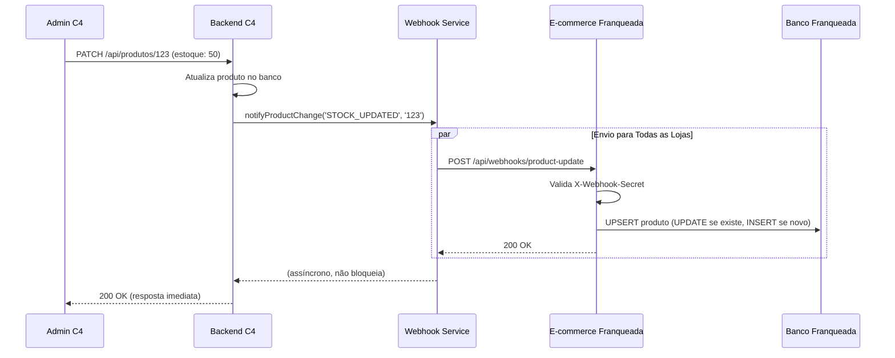
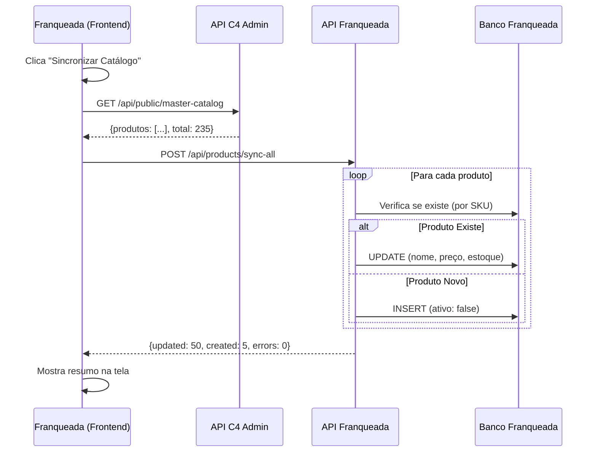

# 🔄 Sistema de Sincronização Bidirecional de Produtos

## 📋 Índice

1. [Visão Geral](#visão-geral)
2. [Arquitetura](#arquitetura)
3. [Fluxo de Sincronização](#fluxo-de-sincronização)
4. [Instalação e Configuração](#instalação-e-configuração)
5. [Uso](#uso)
6. [API Reference](#api-reference)
7. [Troubleshooting](#troubleshooting)

---

## 🎯 Visão Geral

Este sistema implementa **sincronização bidirecional** entre o **Painel C4 Admin** (catálogo mestre) e os **E-commerces das Franqueadas**.

### Fluxos Implementados

```
┌─────────────────────────────────────────────────────────────┐
│  FLUXO 1: Pedidos (E-commerce → C4 Admin)                   │
│  ✅ Webhook de Pedidos - IMPLEMENTADO ANTERIORMENTE          │
│  Quando pedido é criado → Decrementa estoque no C4          │
└─────────────────────────────────────────────────────────────┘

┌─────────────────────────────────────────────────────────────┐
│  FLUXO 2: Produtos (C4 Admin → E-commerce)                  │
│  ✅ IMPLEMENTADO NESTA FEATURE                               │
│  Quando produto é criado/atualizado → Sincroniza franqueadas│
└─────────────────────────────────────────────────────────────┘
```

---

## 🏗️ Arquitetura

### Componentes do Sistema

```
┌──────────────────────────────────────────────────────────────┐
│                    PAINEL C4 ADMIN                            │
├──────────────────────────────────────────────────────────────┤
│                                                               │
│  📦 Catálogo Mestre (PostgreSQL)                             │
│  ├─ produtos (tabela principal)                              │
│  └─ lojas (webhook_product_url, webhook_secret)              │
│                                                               │
│  🔔 Webhook Service (lib/webhookService.ts)                  │
│  ├─ notifyProductChange() - Notifica TODAS as lojas          │
│  └─ notifyProductChangeToLoja() - Notifica loja específica   │
│                                                               │
│  📡 API Endpoints                                             │
│  ├─ PATCH /api/produtos/[id] - Atualiza produto + webhook    │
│  └─ GET /api/public/master-catalog - Catálogo completo       │
│                                                               │
└──────────────────────────────────────────────────────────────┘
                              │
                              │ HTTP POST
                              │ (Webhook)
                              ▼
┌──────────────────────────────────────────────────────────────┐
│                E-COMMERCE DA FRANQUEADA                       │
├──────────────────────────────────────────────────────────────┤
│                                                               │
│  📥 Webhook Receiver                                          │
│  ├─ POST /api/webhooks/product-update                        │
│  └─ Valida X-Webhook-Secret + Upsert no banco                │
│                                                               │
│  🔄 Sincronização Manual                                      │
│  ├─ POST /api/products/sync-all                              │
│  └─ <SyncCatalogButton /> - Componente React                 │
│                                                               │
│  📦 Banco de Dados Local                                      │
│  └─ produtos (cópia sincronizada)                            │
│                                                               │
└──────────────────────────────────────────────────────────────┘
```

---

## 📊 Fluxo de Sincronização

### SOLUÇÃO 1: Webhook Automático



**Características:**
- ⚡ **Tempo Real**: Sincronização instantânea
- 🔄 **Automático**: Sem intervenção manual
- 🎯 **Eficiente**: Apenas mudanças são enviadas
- 🔒 **Seguro**: Validação por X-Webhook-Secret

---

### SOLUÇÃO 2: Sincronização Manual



**Características:**
- 🎛️ **Controle**: Franqueada decide quando sincronizar
- 📦 **Completo**: Sincroniza catálogo inteiro
- 🔄 **Backup**: Funciona se webhooks falharem
- 📊 **Feedback**: Mostra resultado detalhado

---

## ⚙️ Instalação e Configuração

### 1. Aplicar Migration no Banco de Dados

Execute a migration no Supabase:

```bash
node scripts/apply_migrations.mjs
```

Ou aplique manualmente:

```sql
-- migrations/015_add_webhook_product_sync.sql
ALTER TABLE lojas
  ADD COLUMN IF NOT EXISTS webhook_product_url TEXT,
  ADD COLUMN IF NOT EXISTS webhook_secret TEXT,
  ADD COLUMN IF NOT EXISTS auto_sync_enabled BOOLEAN DEFAULT true,
  ADD COLUMN IF NOT EXISTS last_product_sync_at TIMESTAMP;
```

---

### 2. Configurar Variáveis de Ambiente

#### **Backend C4 Admin** (.env.local)

```env
# Supabase (já existente)
NEXT_PUBLIC_SUPABASE_URL=https://xyz.supabase.co
SUPABASE_SERVICE_ROLE_KEY=eyJ...

# API Key para autenticação do catálogo público
API_KEY=sua-chave-secreta-aqui

# Webhook Secret (compartilhado com franqueadas)
WEBHOOK_PRODUCT_SECRET=webhook-secret-super-secreto-123
```

#### **E-commerce Franqueada** (.env.local)

```env
# Supabase (banco local da franqueada)
NEXT_PUBLIC_SUPABASE_URL=https://abc.supabase.co
SUPABASE_SERVICE_ROLE_KEY=eyJ...

# Webhook Secret (MESMO valor do C4 Admin)
WEBHOOK_PRODUCT_SECRET=webhook-secret-super-secreto-123

# URL do catálogo mestre (C4 Admin)
C4_MASTER_CATALOG_URL=https://c4franquiaas.netlify.app/api/public/master-catalog
C4_API_KEY=sua-chave-secreta-aqui
```

---

### 3. Configurar Webhook URL na Tabela `lojas`

No banco de dados do **C4 Admin**, configure cada loja:

```sql
UPDATE lojas
SET 
  webhook_product_url = 'https://cjotarasteirinhas.com.br/api/webhooks/product-update',
  webhook_secret = 'webhook-secret-super-secreto-123',
  auto_sync_enabled = true
WHERE dominio = 'cjotarasteirinhas';
```

---

## 🚀 Uso

### SOLUÇÃO 1: Webhook Automático

#### No Backend C4 Admin

Já está integrado! Quando um produto é atualizado via `PATCH /api/produtos/[id]`, o webhook é disparado automaticamente:

```typescript
// app/api/produtos/[id]/route.ts

// Atualiza produto
const { data: updated } = await supabase
  .from('produtos')
  .update({ estoque: 50 })
  .eq('id', produtoId);

// 🔔 Webhook automático
notifyProductChange('STOCK_UPDATED', produtoId);
```

#### Testar Manualmente

```bash
curl -X PATCH https://c4franquiaas.netlify.app/api/produtos/123 \
  -H "Content-Type: application/json" \
  -d '{"estoque": 100}'
```

Isso enviará webhook para **TODAS** as lojas com `auto_sync_enabled = true`.

---

### SOLUÇÃO 2: Botão de Sincronização Manual

#### No Frontend da Franqueada

```tsx
// pages/produtos.tsx ou similar

import SyncCatalogButton from '@/components/SyncCatalogButton';

export default function ProdutosPage() {
  return (
    <div>
      <h1>Meus Produtos</h1>
      
      <SyncCatalogButton
        masterCatalogUrl={process.env.NEXT_PUBLIC_C4_MASTER_CATALOG_URL!}
        apiKey={process.env.NEXT_PUBLIC_C4_API_KEY!}
        mode="update_only" // ou "create_and_update"
        onSyncComplete={(result) => {
          console.log('Sincronização concluída!', result);
          // Recarregar lista de produtos
          window.location.reload();
        }}
      />
      
      {/* Lista de produtos */}
    </div>
  );
}
```

---

## 📡 API Reference

### 1. POST /api/webhooks/product-update

**Descrição**: Recebe notificações de mudanças de produtos (E-commerce Franqueada)

**Headers**:
```
X-Webhook-Secret: webhook-secret-super-secreto-123
X-Webhook-Event: PRODUCT_UPDATED | STOCK_UPDATED | PRODUCT_CREATED
X-Webhook-Source: c4-admin
Content-Type: application/json
```

**Body**:
```json
{
  "eventType": "STOCK_UPDATED",
  "timestamp": "2025-10-25T14:30:00Z",
  "produto": {
    "id": "uuid-123",
    "sku": "SKU-34",
    "nome": "Rasteirinha Feminina",
    "preco_base": 199.90,
    "estoque": 50,
    "ativo": true,
    "imagem": "https://...",
    "variacoes_meta": [...]
  }
}
```

**Response**:
```json
{
  "success": true,
  "action": "updated",
  "productId": "local-uuid-456",
  "sku": "SKU-34"
}
```

---

### 2. GET /api/public/master-catalog

**Descrição**: Retorna catálogo completo de produtos (C4 Admin)

**Headers**:
```
X-API-Key: sua-chave-secreta-aqui
```

**Query Params**:
- `only_active` (boolean): Filtrar apenas produtos ativos
- `categoria_id` (uuid): Filtrar por categoria
- `limit` (number): Limite de resultados (padrão: 1000)
- `offset` (number): Paginação (padrão: 0)

**Response**:
```json
{
  "success": true,
  "timestamp": "2025-10-25T14:30:00Z",
  "total": 235,
  "limit": 1000,
  "offset": 0,
  "produtos": [
    {
      "id": "uuid-123",
      "sku": "SKU-34",
      "nome": "Rasteirinha Feminina",
      "preco_base": 199.90,
      "estoque": 50,
      "ativo": true,
      "imagem": "https://...",
      "variacoes_meta": [...]
    }
  ]
}
```

---

### 3. POST /api/products/sync-all

**Descrição**: Sincronização em lote de produtos (E-commerce Franqueada)

**Body**:
```json
{
  "produtos": [...], // Array de produtos do master-catalog
  "mode": "update_only" // ou "create_and_update"
}
```

**Response**:
```json
{
  "success": true,
  "timestamp": "2025-10-25T14:30:00Z",
  "result": {
    "total": 235,
    "updated": 230,
    "created": 5,
    "skipped": 0,
    "errors": 0,
    "details": [...]
  }
}
```

---

## 🔧 Troubleshooting

### Webhook não está sendo recebido

**Verificar**:
1. URL do webhook está correta na tabela `lojas`?
   ```sql
   SELECT webhook_product_url, auto_sync_enabled 
   FROM lojas 
   WHERE dominio = 'cjotarasteirinhas';
   ```

2. Secret está configurado no `.env.local` da franqueada?
   ```bash
   echo $WEBHOOK_PRODUCT_SECRET
   ```

3. Logs no console do C4 Admin:
   ```
   [webhookService] 📤 Enviando webhook para...
   [webhookService] ✅ Webhook enviado com sucesso
   ```

4. Logs no console da Franqueada:
   ```
   [webhook/product-update] 📥 Webhook recebido
   [webhook/product-update] ✅ Produto atualizado
   ```

---

### Sincronização manual falha

**Verificar**:
1. API Key está correta?
2. URL do catálogo mestre está acessível?
   ```bash
   curl https://c4franquiaas.netlify.app/api/public/master-catalog \
     -H "X-API-Key: sua-chave"
   ```

3. Endpoint `/api/products/sync-all` existe no projeto da franqueada?

---

### Produtos novos ficam desativados

**Comportamento esperado!** 🔒

Por segurança, produtos novos sincronizados são criados como `ativo: false`.

**Ativar manualmente**:
```sql
UPDATE produtos 
SET ativo = true 
WHERE codigo_barras = 'SKU-34';
```

Ou via interface no painel da franqueada.

---

## 📊 Monitoramento

### Query úteis

**Ver última sincronização de cada loja**:
```sql
SELECT 
  nome,
  dominio,
  last_product_sync_at,
  auto_sync_enabled,
  webhook_product_url IS NOT NULL as webhook_configurado
FROM lojas
ORDER BY last_product_sync_at DESC NULLS LAST;
```

**Produtos sincronizados recentemente**:
```sql
SELECT 
  nome,
  codigo_barras,
  estoque,
  last_synced_at
FROM produtos
WHERE last_synced_at > NOW() - INTERVAL '1 hour'
ORDER BY last_synced_at DESC;
```

---

## 🎯 Próximos Passos

- [ ] Dashboard de monitoramento de webhooks
- [ ] Retry automático em caso de falha
- [ ] Fila de webhooks (Redis/BullMQ)
- [ ] Webhook de exclusão de produtos
- [ ] Sincronização de categorias
- [ ] Histórico de sincronizações

---

**Documentação criada em**: 25 de outubro de 2025  
**Versão**: 1.0.0  
**Autor**: GitHub Copilot
