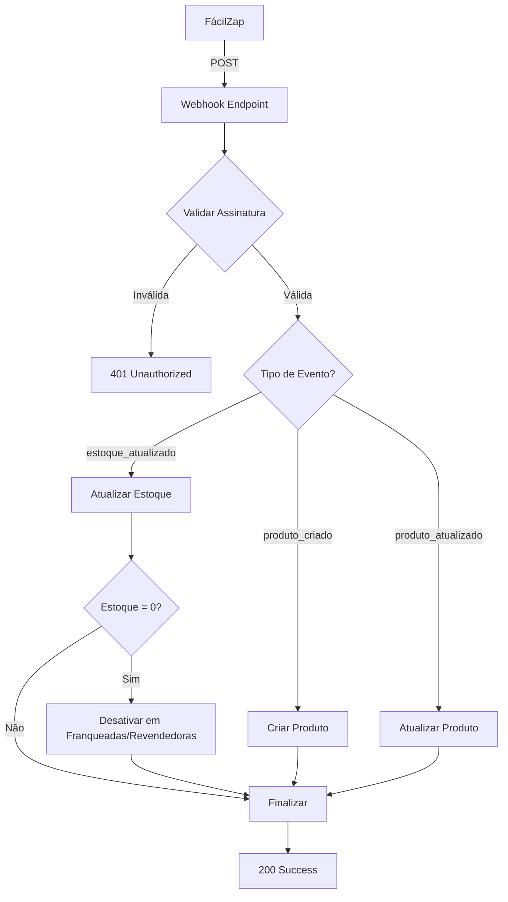

# 📡 Webhook FácilZap - Documentação Técnica

## 🎯 Objetivo
Sincronização em tempo real de produtos e estoque do FácilZap para o sistema C4 Franquias.

---

## 🔗 Endpoint do Webhook

### URL de Produção
```
https://c4franquiaas.netlify.app/api/webhook/facilzap
```

### URL de Desenvolvimento
```
http://localhost:3000/api/webhook/facilzap
```

### Método HTTP
```
POST
```

---

## 🔐 Segurança

### Header de Autenticação
O webhook valida a origem através de uma assinatura secreta:

```http
X-FacilZap-Signature: SUA_CHAVE_SECRETA_AQUI
```

### Variável de Ambiente
Configure no arquivo `.env.local`:

```env
FACILZAP_WEBHOOK_SECRET=sua_chave_secreta_compartilhada_com_facilzap
```

---

## 📦 Eventos Suportados

### 1. Produto Criado
**Event:** `produto_criado`

Disparado quando um novo produto é criado no FácilZap.

**Payload Exemplo:**
```json
{
  "event": "produto_criado",
  "produto_id": "FAC123456",
  "timestamp": "2025-11-18T10:30:00Z",
  "data": {
    "nome": "Sandália Nude 37",
    "preco": 89.90,
    "estoque": 15,
    "imagem": "https://facilzap.com/produtos/imagem123.jpg",
    "ativo": true,
    "sku": "SAN-NUDE-37",
    "descricao": "Sandália feminina confortável"
  }
}
```

**Ação do Sistema:**
- Cria novo registro na tabela `produtos`
- Armazena `facilzap_id` para sincronização futura
- Define `preco_base`, `estoque`, `imagem` e outras informações

---

### 2. Produto Atualizado
**Event:** `produto_atualizado`

Disparado quando informações de um produto são alteradas no FácilZap.

**Payload Exemplo:**
```json
{
  "event": "produto_atualizado",
  "produto_id": "FAC123456",
  "timestamp": "2025-11-18T11:00:00Z",
  "data": {
    "nome": "Sandália Nude 37 - Promoção",
    "preco": 79.90,
    "imagem": "https://facilzap.com/produtos/imagem123-v2.jpg"
  }
}
```

**Ação do Sistema:**
- Atualiza apenas os campos enviados no payload
- Mantém outros campos inalterados
- Atualiza `ultima_sincronizacao`

---

### 3. Estoque Atualizado ⭐ (MAIS FREQUENTE)
**Event:** `estoque_atualizado`

Disparado quando o estoque de um produto é alterado.

**Payload Exemplo:**
```json
{
  "event": "estoque_atualizado",
  "produto_id": "FAC123456",
  "timestamp": "2025-11-18T12:15:00Z",
  "data": {
    "estoque": 0
  }
}
```

**Ação do Sistema:**
- Atualiza campo `estoque` na tabela `produtos`
- **REGRA CRÍTICA:** Se `estoque = 0`:
  - Desativa produto em `produtos_franqueadas_precos` (`ativo_no_site = false`)
  - Desativa produto em `reseller_products` (`is_active = false`)
  - Registra log da desativação automática

---

## 🔄 Fluxo de Sincronização



---

## ✅ Respostas da API

### Sucesso (200 OK)
```json
{
  "success": true,
  "message": "Evento estoque_atualizado processado com sucesso",
  "result": {
    "produto_id": "uuid-do-produto-no-sistema",
    "action": "stock_updated",
    "novo_estoque": 0
  }
}
```

### Erro de Autenticação (401)
```json
{
  "error": "Unauthorized: Invalid signature"
}
```

### Erro de Payload (400)
```json
{
  "error": "Invalid payload: missing required fields"
}
```

### Erro Interno (500)
```json
{
  "error": "Internal server error",
  "message": "Descrição do erro"
}
```

---

## 🛠️ Configuração no FácilZap

### Passo 1: Acessar Configurações
1. Entre no painel do FácilZap
2. Navegue até **Configurações → Integrações → Webhooks**

### Passo 2: Adicionar Webhook
- **URL do Webhook:** `https://c4franquiaas.netlify.app/api/webhook/facilzap`
- **Método:** `POST`
- **Header Personalizado:**
  - Nome: `X-FacilZap-Signature`
  - Valor: `SUA_CHAVE_SECRETA` (mesma do `.env`)

### Passo 3: Selecionar Eventos
Marque os eventos que deseja receber:
- ✅ Produto Criado
- ✅ Produto Atualizado
- ✅ Estoque Atualizado

### Passo 4: Testar Webhook
Use o botão "Testar Webhook" no painel do FácilZap.

---

## 🧪 Testando Localmente

### Usando cURL
```bash
curl -X POST http://localhost:3000/api/webhook/facilzap \
  -H "Content-Type: application/json" \
  -H "X-FacilZap-Signature: sua_chave_secreta" \
  -d '{
    "event": "estoque_atualizado",
    "produto_id": "FAC123456",
    "timestamp": "2025-11-18T10:00:00Z",
    "data": {
      "estoque": 0
    }
  }'
```

### Usando Postman
1. Método: `POST`
2. URL: `http://localhost:3000/api/webhook/facilzap`
3. Headers:
   - `Content-Type: application/json`
   - `X-FacilZap-Signature: sua_chave_secreta`
4. Body (raw JSON): Copie um dos payloads de exemplo acima

---

## 📊 Monitoramento

### Logs do Webhook
Os logs são exibidos no console do servidor:

```
📥 Webhook recebido: { event: 'estoque_atualizado', produto_id: 'FAC123456' }
📦 Atualizando estoque: FAC123456 → 0
✅ Estoque atualizado com sucesso: uuid-produto
🚫 Estoque zerado! Desativando produto em franqueadas/revendedoras
✅ Produto desativado em franqueadas
✅ Produto desativado em revendedoras
✅ Produto desativado em todos os painéis
```

### Tabela de Logs
Os eventos são registrados na tabela `logs_sincronizacao`:

```sql
SELECT * FROM logs_sincronizacao 
WHERE tipo = 'estoque_zerado' 
ORDER BY timestamp DESC 
LIMIT 10;
```

---

## 🔧 Manutenção

### Adicionar Nova Coluna ao Produto
Edite a função `handleProdutoAtualizado`:

```typescript
if (data.nova_coluna !== undefined) updateData.nova_coluna = data.nova_coluna;
```

### Modificar Regra de Desativação
Edite a função `desativarProdutoEstoqueZero` para adicionar lógica customizada.

---

## 📞 Suporte

**Documentação Completa:** https://docs.c4franquias.com.br/webhook/facilzap  
**Suporte Técnico:** suporte@c4franquias.com.br  
**Status da API:** https://status.c4franquias.com.br

---

## 🚀 Próximos Passos

Após implementar o webhook:

1. ✅ Configurar variável `FACILZAP_WEBHOOK_SECRET` no Netlify
2. ✅ Adicionar coluna `facilzap_id` na tabela `produtos` (se não existir)
3. ✅ Criar tabela `logs_sincronizacao` para auditoria
4. ✅ Testar cada tipo de evento em ambiente de desenvolvimento
5. ✅ Configurar webhook no painel do FácilZap
6. ✅ Monitorar logs nas primeiras 24 horas

---

**Versão:** 1.0.0  
**Última Atualização:** 18/11/2025  
**Autor:** Sistema C4 Franquias
